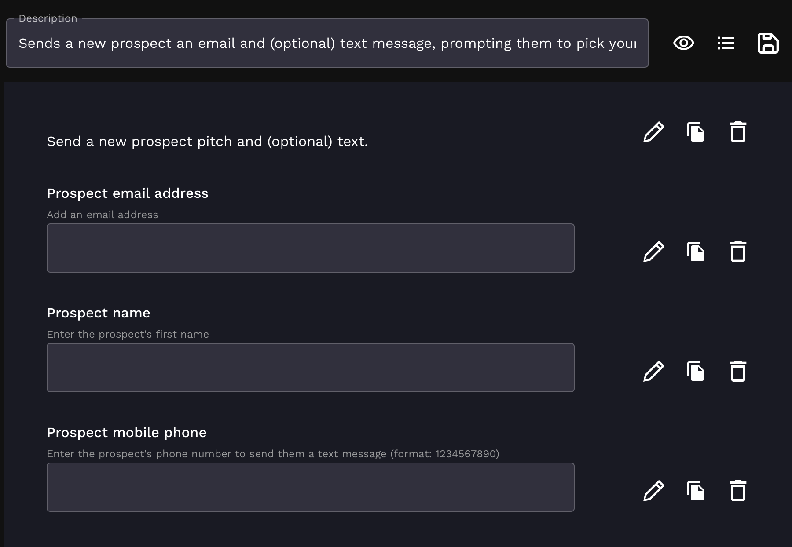
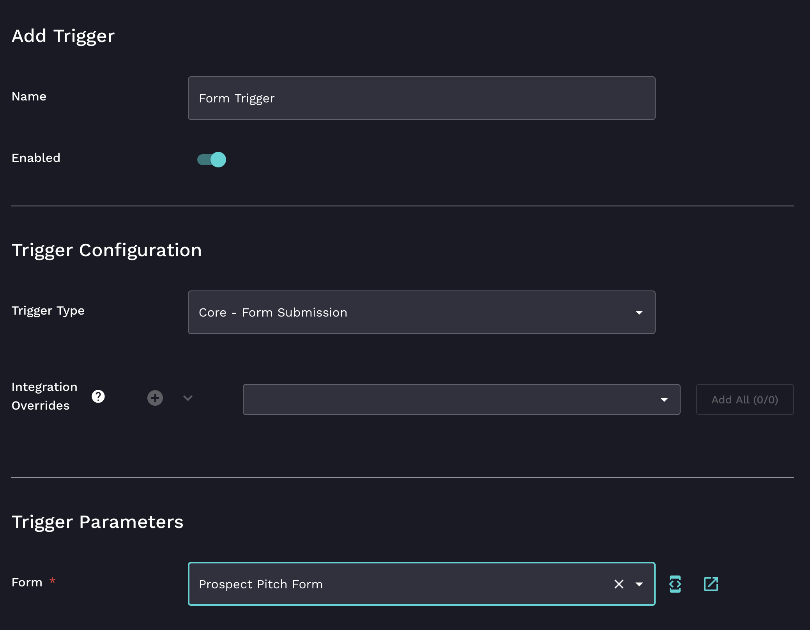
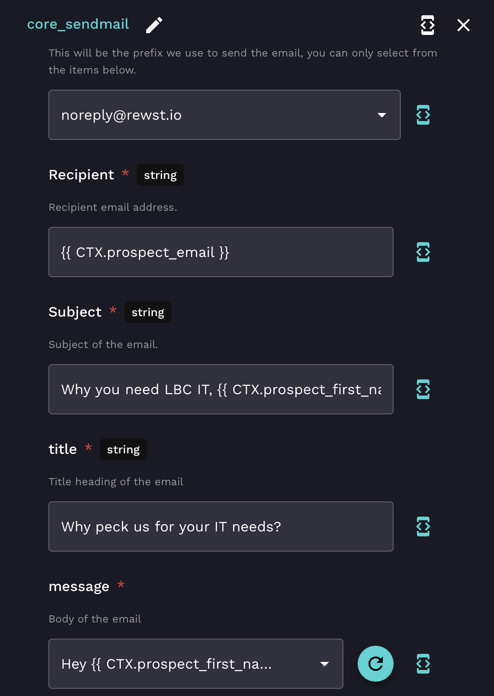
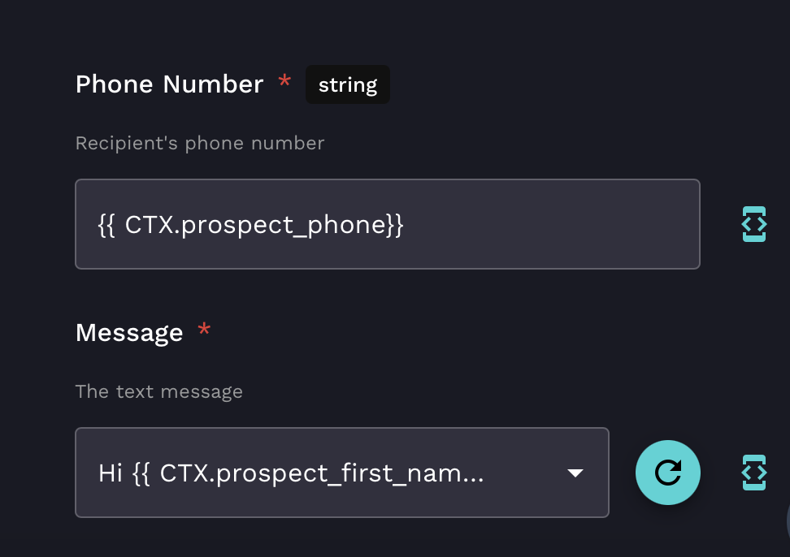
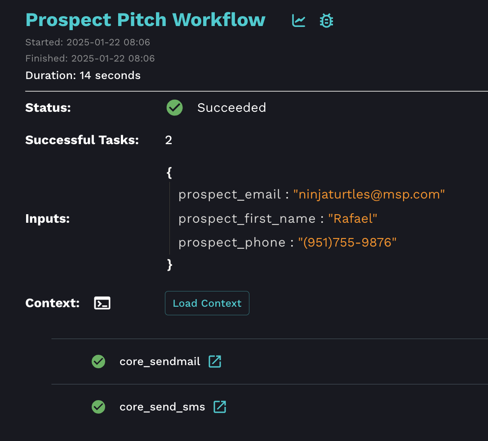

# Email + Text Message Automation

## New prospect pitch overview

This workflow sends a personalized email and optional text message to a new MSP prospect, pitching your automation services. Just fill out a Rewst form to kick it off.

It’s simple to set up, using only core tasks in Rewst — no integrations needed. You’ll need:

1. The URL for a prospect-facing resource to include in your pitch email — for example, a Go-To-Market handout or YouTube video
2. Your mobile phone, to test the **send SMS** task on yourself

***

## **Step 1: Create the form**

1. Log in to the Rewst platform.
2. Navigate to **Automations** > **Forms** in the left side men&#x75;**.**
3.  Click **+** to create a new form.\
    \


    <figure><figcaption></figcaption></figure>
4. Enter `Prospect Pitch Form` into the **Form Name** field.
5. Click **Submit**.
6. Add the following fields by dragging the **Text Input** element into your form builder, with the values specified below:
   * **Text Input:**&#x20;
     * **Field Name:** `prospect_email`
     * **Field Label:** Prospect email address&#x20;
     *   **Field Description:** Add an email address\


         <figure><figcaption></figcaption></figure>
   * **Text Input:**&#x20;
     * **Field Name:** `prospect_first_name`
     * **Field Label:** Prospect name&#x20;
     * **Field Description:** Enter the prospect's first name
   * **Text Input:**&#x20;
     * **Field Name:** `prospect_phone`
     * **Field Label:** Prospect mobile phone&#x20;
     * **Field Description:** Enter the prospect's phone number to send them a text message, using the format as follows: 1234567890
7. Click the **Save** icon at the top right of the for&#x6D;**.**
8. Click **Submit**.


Rewst form field names become context variables in your workflow. Think of them like placeholders for data, making your workflows adaptable.

`prospect_email` in form becomes`{{ CTX.prospect_email }}` in workflow.



<figure><figcaption></figcaption></figure>

***

## **Step 2: Build the workflow**

This workflow will send a personalized email and optional text using the form submission as input.

1. Navigate to **Automations** > **Workflows.**
2.  Click **Create** to create a new workflow. \


    <figure><figcaption></figcaption></figure>
3. Enter `Prospect Pitch Workflow` in the **Name** field.
4. Add any **Tags** you'd like, to stay organized.&#x20;
5. Click **Submit**.

### Add the trigger

1.  Click the **Trigger** button, denoted by a blue lightning bolt, in the top menu. Your load time to establish the trigger may take a moment.\


    <figure><figcaption></figcaption></figure>
2. Enter `Form Trigger`  in the **Name** field.
3. Toggle **Enabled** to on to activate this trigger.
   1. With the trigger active, every form submission will start our new workflow.
4. Choose the `Core - Form Submission` from the **Trigger Type** drop down menu field. You can type in this menu field to jump to your desired trigger type instead of scrolling through the long list.
5. Select the `Prospect Pitch Form` you created under **Trigger Parameters.**
6. Click **Submit** at the botto&#x6D;**.**

<figure><figcaption></figcaption></figure>

### **Add the workflow actions**

1. Add the **sendmail** action to the workflow canva&#x73;**.** \
   
2.  Enter the following in the relevant fields of the configuration menu on the right:

    * **Sender:** Select an option.
    * **Recipient:** `{{ CTX.prospect_email }}`
    * **Subject:** `Why you need [your MSP], {{ CTX.prospect_first_name }}`
    * **Title:** Something short and catchy — example: `Why pick [your MSP] for your IT needs?`
    *   **Message:** Open the editor and paste in the code below, tailoring the message to your needs. Replace the purple placeholders with your own info. See the example below from “LBC IT.”

        ```django
        Hey {{ CTX.prospect_first_name }},

        We're not the only MSP, but we *are* the best for your business. 
        Here's why:

        [Resource URL goes here]

        Give us a call when you're ready. We're standing by!

        Cheers,
        The [your MSP] team
        [phone number]

        ```

    <figure><figcaption></figcaption></figure>


If you want to take it a step further, you can add some custom branding to the **Custom HTML** field.&#x20;


3. Add a **Send SMS** action to the workflow canvas under the sendmail action.
4. Enter the following in the relevant fields of the configuration menu on the right:
   * **Phone number:** `{{ CTX.prospect_phone }}`
   * **Message:** Open the editor and paste in the code below, tailoring the message to your needs. See the example below.

```django
Hi {{ CTX.prospect_first_name }}, we're here for your IT needs! 
Check your email to learn more about us.
```

<figure><figcaption></figcaption></figure>

5. Connect the **On Success** transition of the email action to the text message action by clicking and dragging the grey dot in the middle of the transition box.
6. Click **Publish** at the top right.
7. Add a summary of the changes
8. Click **Submit.**

***

## **Step 3: Test the workflow**

### Add input configuration for testing

1.  Open **Configure Workflow Settings,** denoted by a pencil icon, in the top menu. \


    <figure><figcaption></figcaption></figure>
2. Click **Input Configuration +** three times.&#x20;
3. Enter each of the following names into each input configuration's **name** field:
   1. `prospect_email`
   2. `prospect_phone`
   3. `prospect_first_name`
4. Click **Submit**.

<figure><figcaption><p>The three input configurations</p></figcaption></figure>

### Verify that it all works

1. Click the **Test** button in the top menu.
2. Enter your **email**, **phone**, and **first name** into the form.&#x20;
3. Click **Test**.&#x20;
   * Check your inbox to confirm that the email was received and formatted correctly.
   * Check your phone to make sure you that got a text.&#x20;
4. Click the **Results** icon, denoted by a graph, in the top menu.
5. Click the latest execution.&#x20;
   * View more details by selecting the status of your recent test— either **succeeded** or **failed**.

<figure><figcaption></figcaption></figure>

***


Clone this workflow and form to build out another email or text use case! How about a **new MSP employee** welcome automation? Simply swap your form field names and context variables to something like `employee_email` in form and`{{ CTX.employee_email }}` in workflow. Remember to rename your field labels and automations (form and workflow titles) accordingly.


***

## **Future considerations as a completion handler**

Once you have a new user onboarding Crate set up, this workflow can be configured as a completion handler. Here’s how:

1. **Modify the workflow:**
   * Update the trigger to listen for the onboarding Crate’s completion event, instead of the form submission.
   * Use a variable like `{{ onboarding.new_user_email }}` to populate the email field dynamically.
2. **Update the email template:**
   * Include additional details or resources specific to the onboarding process.


For more information on setting up completion handlers, you can go to [completion-handlers-and-workflow-wrappers.md](../../documentation/workflows/completion-handlers-and-workflow-wrappers.md "mention")


***

## Example Jinja snippet for dynamic greeting

Customize the greeting based on the user’s role, or other variables:

```django


Dear Admin {{ form.first_name }},

Dear {{ form.first_name }},


```
