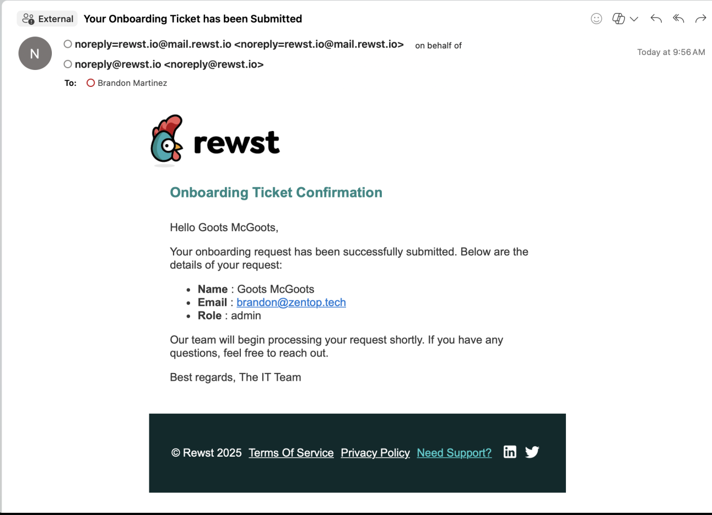

# PSA automation

## Add user to PSA overview

This workflow automates the creation of a ConnectWise Manage ticket based on form submission in Rewst. It’s a great example of how automation ensures task tracking and efficient communication without manual effort.

You can even take it further by making the ticket a trigger for an entire workflow. For instance, once the ticket is created, it can automatically initiate additional tasks, update statuses, or send notifications to stakeholders—streamlining your processes and driving efficiency across your team.

This workflow:

1. Uses a simple form for collecting user data.
2. Integrates with ConnectWise Manage to create tickets automatically.
3. Sends an email to the person submitting the form.


Rewst workflows bridge the gap between tools like ConnectWise and your operational processes. Automating ticket creation ensures every request is logged, tracked, and completed efficiently.


***

## **Step 1: Create the form**

1. Log in to the Rewst platform.
2. Navigate to **Automations** > **Forms** in the left side men&#x75;**.**
3.  Click **+** to create a new form.\


    <figure><figcaption></figcaption></figure>
4. Enter `User Onboarding Form` into the form **Name** field.
5. Click **Submit**.
6.  Add the following fields by dragging the **Text Input** element into your form builder, with the values specified below:

    * **Text Input:**&#x20;
      * **Field Name:** `full_name`
      * **Field Label:** Full name
      * **Field Description:** Add an email address
    * **Text Input:**&#x20;
      * **Field Name:** `email_address`
      * **Field Label:** Email
      * **Required:** Yes
      * **Regex Validation:** `^[a-zA-Z0-9._%+-]+@[a-zA-Z0-9.-]+.[a-zA-Z]{2,}$`
      * **Regex Error Message:** Please enter a valid email address

    Add the following fields by dragging the **Dropdown** element into your form builder, with the values specified below:

    * **Dropdown Field:**&#x20;
      * **Field Name:** `role`
      * **Field Label: :** Role
      * **Required:** Yes
      * **Option 1:**&#x20;
        * **Option Label:** `Admin`
        * **Option Value:** `admin`
      * **Option 2:**&#x20;
        * **Option Label:** `IT Tech`
        * **Option Value:** `it_tech`
      * **Option 3:**&#x20;
        * **Option Label:** `User`
        * **Option Value:** `user`
    * **Dropdown Field:**&#x20;
      * **Field Name:** `company_name`
      * **Field Label: :** Company Name
      * **Required:** Yes
      * **Dynamic Options:** On
      * **Integration:** ConnectWise PSA
      * **Resource:** Company
7. Click **Save** at the top right of the for&#x6D;**.**
8. Click **Submit**.

<figure><figcaption></figcaption></figure>


Form fields become context variables in workflows, allowing you to map data dynamically in actions.


***

## **Step 2: Build the workflow**

This workflow will log the form submission as a ticket in ConnectWise Manage.

1. Navigate to **Automations** **> Workflows** in the left side men&#x75;**.**
2. Click **Create** to create a new Workflow.
3. Enter `Submit Onboarding Ticket to ConnectWise`  in the **Name** field.
4. Add any **Tags** you'd like, to stay organized.&#x20;
5. Click **Submit**.

### **Add a trigger**&#x20;

1. Click the **Trigger** button, denoted by a blue lightning bolt, in the top menu. Your load time to establish the trigger may take a moment.&#x20;
2. Enter `User Onboarding Trigger`  in the **Name** field.
3. Toggle **Enabled** to on to activate this trigger.
   1. With the trigger active, every form submission will start our new workflow.
4. Choose the `Core - Form Submission` from the **Trigger Type** drop down menu field. You can type in this menu field to jump to your desired trigger type instead of scrolling through the long list.
5. Select the `User Onboarding Form` you created under **Trigger Parameters.**
6. Click **Submit** at the botto&#x6D;**.**

***

### Add the create service ticket action

1. Add the **Create Service Ticket** action from **ConnectWise PSA** to the workflow canva&#x73;**.**&#x20;
2. Change the name to `create_onboarding_ticket` at the top right.
3. Enter the following in the **Description** field in the configuration:

```django
A new user needs to be onboarded with the following details:
- **Full Name**: {{ CTX.full_name }}
- **Email**: {{ CTX.email }}
- **Role**: {{ CTX.role }}
```

4. Add the following to the **Summary** under **Parameters:**&#x20;

```django
New User Onboarding: {{ CTX.full_name }}
```

5. Select the appropriate service board. For example, Onboarding or Service Requests.
6. Add the following to **Company:**

```django
{{ CTX.company_name }}
```

6. Add the following to **Priority**:

```django


1

3


```


Use Jinja to add dynamic logic to workflows, customizing tickets based on context variables like role or priority.

For instance, if a new admin is added, you can make the ticket a higher priority. ConnectWise has 1-3 for ticket priority levels, with 1 being the highest.


* We recommend filling out the following fields to match your onboarding requirements to save time on manual ticket updates. Each of these fields will match incoming tickets to their correct space in your ConnectWise platform:
  * **Board ID** - what board the ticket should send to, which ensures that the board is connected
  * **Status** - what status the ticket should default to, which should be “New” or something along those lines
  * **Type** - onboarding
  * **Subtype** - any subtypes your company uses for onboarding tickets
  * **Item** - items provide context to a ticket by specifying the asset or service affected


Making this a trigger for automatic onboarding can level this workflow up even more!

* If not triggering an automated onboarding workflow, make sure to put an internal note in, including a link to the onboarding form, for a tech to fill out.
* Fill public discussion note with submission details to send confirmation email to the primary contact set for the company in ConnectWise PSA if any confirmation workflows exist.


***

### **Send confirmation email**

1. Add the **sendmail** action to the workflow canva&#x73;**.**&#x20;
2. Change the name to `send_confirmation_email` at the top right.
3. Enter the following in the relevant fields of the configuration menu on the right:
   * **Sender:** Select an option.
   * **Recipient:** `{{ CTX.email }}`
   * **Subject:** `Your Onboarding Ticket has been Submitted`
   * **Title:** `Onboarding Ticket Confirmation`
   * **Message:** Open the editor and paste in the code below, tailoring the message to your needs.&#x20;


```django
Hello {{ CTX.full_name }},

Your onboarding request has been successfully submitted. Below are the details of your request:

- **Name**: {{ CTX.full_name }}
- **Email**: {{ CTX.email_address }}
- **Role**: {{ CTX.role }}

Our team will begin processing your request shortly. If you have any questions, feel free to reach out.

Best regards,
The IT Team
```


<figure><figcaption></figcaption></figure>

4. Connect the **On Success** transition of the ConnectWise action to the email action.

***

### **Send internal error email**

1. Add the **sendmail** action to the workflow canva&#x73;**.**&#x20;
2. Change the name to `internal_failure_email` at the top right.
3. Enter the following in the relevant fields of the configuration menu on the right:
   * **Sender:** Select an option.
   * **Recipient:** An Admin email. Try your own for testing
   * **Subject:** `Failed to Create Ticket: {{ CTX.full_name }}`
   * **Title:** `Attention Needed`
   * **Message:** Open the editor and paste in the code below, tailoring the message to your needs.&#x20;

<pre class="language-django" data-overflow="wrap"><code class="lang-django"><strong>Hello Team,
</strong>
A ticket creation attempt in ConnectWise has failed. Below are the details of the failed request:

- **Name**: {{ CTX.full_name }}
- **Email**: {{ CTX.email }}
- **Role**: {{ CTX.role }}
- **Error Message**: {{ CTX.last_error }}

Please investigate the issue and take corrective action. If needed, manually create the ticket in ConnectWise using the information provided above.

Best regards,
The Automation System
</code></pre>

4. Click **+** on the **ConnectWise** Action to add a Transitio&#x6E;**.**
5. Click on the new transition.
6. Change the condition to **On Failure**.
7. Connect the **On Failure** transition of the **ConnectWise** action to the new email action.

<figure><figcaption></figcaption></figure>

## **Test the workflow**

### Option 1 - Testing with the form

1. **Submit** the form:
   * Open the form URL and submit test data:
     * Example: John Doe, [john.doe@example.com](mailto:john.doe@example.com), Admin
2. Verify the Ticket in ConnectWise:
   * Navigate to the specified service board in ConnectWise Manage.
   * Confirm that the ticket has been created with the submitted details.
3. Verify email receipt.

### Option 2 - Testing with input variables

1. Configure input variables
   1. Click **Configure Workflow Settings**.
   2. Add the following input configuration:
      * **Full Name**
        * **Variable Name**: `full_name`
        * **Type**: String
        * **Purpose**: To capture the user's full name.
        * **Example Value**: `John Doe`
      * **Email Address**
        * **Variable Name**: `email`
        * **Type**: String
        * **Purpose**: To capture the user's email address.
        * **Example Value**: `john.doe@example.com`
      * **Role/Position**
        * **Variable Name**: `role`
        * **Type**: String
        * **Purpose**: To capture the user's role or position.
        * **Example Value**: `Admin`
      * **Company**
        * **Variable Name**: `company`
        * **Type**: String
        * **Purpose**: To capture the name of the user's company.
        * **Example Value**: `Tech Solutions Inc.`
   3. Run the workflow.
   4. Verify results in ConnectWise.
   5. Navigate to the specified service board in ConnectWise Manage.
   6. Confirm that the ticket has been created with the submitted details.
   7. **V**erify email receipt.


Testing ensures that the workflow behaves as expected and the integration with ConnectWise is functioning correctly.


***

## **Step 6: Make it reusable**

1. **Generalize inputs**:
   * Use dynamic variables (e.g., `{{ CTX.company_id }}`) for broader applicability.
2. **Save as a template**:
   * Document steps for customization so other team members can reuse this workflow for different forms or ticket types.

***
