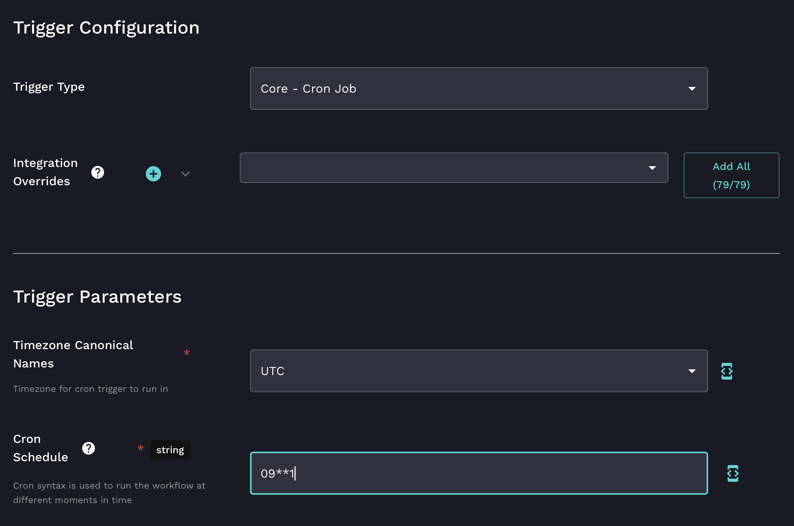
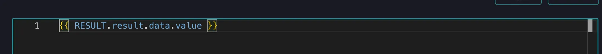

# User report (Microsoft Graph)

## User report overview

This workflow retrieves a list of active users from Microsoft Graph on a scheduled basis, processes the data using [**Jinja list comprehension**](../rewst-foundations/jinja-essentials-for-workflow-automation/jinja-list-comprehension.md), and sends it to a specified email recipient. If the workflow fails at any step, a failure notification is sent to an admin.

This workflow uses:

1. A cron trigger to schedule execution.
2. Microsoft Graph integration to fetch user data.
3. Jinja for list comprehension to filter and format data.
4. Dynamic success and failure email notifications.


Jinja makes it easy to process and filter data dynamically without needing external scripts. Perfect for lightweight automations like generating reports!


***

## **Step 1: Build the workflow**

1. Navigate to **Automations** **> Workflows** in the left side men&#x75;**.**
2.  Click **Create** to create a new Workflow.\


    <figure><figcaption></figcaption></figure>
3. Enter `Microsoft Graph Special User Report Workflow` in the **Name** field.
4. Add any **Tags** you'd like, to stay organized.&#x20;
5. Click **Submit**.

***

## **Step 2: Configure the workflow**

### Add the trigger

1.  Click the **Trigger** button, denoted by a blue lightning bolt, in the top menu. Your load time to establish the trigger may take a moment.\


    <figure><figcaption></figcaption></figure>
2. Enter `User Report Cron Trigger`  in the **Name** field.
3. Toggle **Enabled** to on to activate this trigger.
   1. With the trigger active, every form submission will start our new workflow.
4. Choose the `Core - Cron Job` from the **Trigger Type** drop down menu field. You can type in this menu field to jump to your desired trigger type instead of scrolling through the long list.
5. Add the following under the **Trigger Parameters** men&#x75;**:**
   * Set a schedule for running the workflow in the **Cron Schedule** field, such as 09\*\*1. This would run every Monday at 9:00 AM.
6. Click **Submit** at the botto&#x6D;**.**

<figure><figcaption></figcaption></figure>


No need to mess around with cron coding for your testing. Simply hit the **test** button at the top of your workflow to give it a spin!


***

### **Fetch the user data**

1. Add the **List Users** action from **Microsoft Graph** to the workflow canva&#x73;**.**&#x20;
2. Click on the **On Success Transition.**
3. Click the **+** button next to Data Aliases.
4. Type `result` for the key.
5.  Add the following to the value:&#x20;

    `{{ RESULT.result.data.value }}`

<figure><figcaption></figcaption></figure>

6. Click the **+** on the action.&#x20;
7. Change the **Condition** of the transition to **On Failure**.

<figure><figcaption></figcaption></figure>

8. Click the **+** button next to **Data Aliases**.
9. Type `failure_message` for the key.
10. Add the following to the value: Failed to list all users


What the heck is \{{ RESULT.result.data.value \}}? [Check out this video to learn more](../micro-courses/how-to-reference-data-with-variables.md).


<figure><figcaption></figcaption></figure>

***

### **Compile a List of Special Users**

1. Add the **noop** action to the workflow canva&#x73;**.** \
   
2. Change the name from `core_noop` to `filter_user_list` at the top right.
3. Click on the **On Success Transition.**
4. Click the **+** button next to **Data Aliases**.
5. Enter `special_users` for the key.
6. Add the following to the value:&#x20;

```django
{{
    {
        "email": user.mail
        "givenName": user.givenName
        "displayName": user.displayName
        "officeLocation": user.officeLocation
    } for user in CTX.all_users if user.officeLocation == "Main"
}}
```


Filtering the user data dynamically with Jinja ensures that you only process the relevant subset of users. This step prepares the data for the email. For our example, we only want to see users in the Main Office. So we use an “if statement” to only select “Main” Office workers, we'll then extract specific information about those users.


6. Connect the **On Success** transition of the **List Users** action to the **filter\_user\_list** Noop action.

<figure><figcaption><p>Click and drag the grey dot to connect</p></figcaption></figure>

***

### **Send success email**

1. Add the **sendmail** action from to the workflow canva&#x73;**.**&#x20;
2. Change the name from `core_sendmail` to `send_success_email` at the top right.
3. Enter the following in the relevant fields of the configuration menu on the right:
   * **Sender:** Select an option.
   * **Recipient:** [your-team@example.com](mailto:your-team@example.com) , or whatever is your desired email address
   * **Subject:** Here’s your user list!&#x20;
   * **Message:** Open the editor and paste in the code below, tailoring the message to your needs:

```django
Hello, 

Here is the list of special users from the Main Office:



- **User DisplayName:** {{ user.displayName }}
- **User Given Name:** {{ user.givenName }}
- **User Email:** {{ user.email }}
***



Best regards, 
The Automation Team
```

3. **Connect** the **On Success** transition from the Noop action to the **Success** sendmail action.

<figure><figcaption></figcaption></figure>

***

### &#x20;**Send failure notification**

1. Add the **sendmail** action from to the workflow canva&#x73;**.**&#x20;
2. Change the name from `core_sendmail` to `send_failure_email` at the top right.
3. Enter the following in the relevant fields of the configuration menu on the right:
   * **Sender:** Select an option.
   * **Recipient:** [your-team@example.com](mailto:your-team@example.com) , or your desired email addresses and however they are formatted
   * **Subject:** Workflow Failure: Special User Report
   * **Message:** Open the editor and paste in the code below, tailoring the message to your needs:


```django
The workflow to generate the special user report failed or returned no results. Please check the logs for details.

Error Details:
{{ CTX.failure_message }}

Best regards,
The Automation Team
```


***

### 6. Save the workflow and test it

* Temporarily edit the email action’s recipient to your email.
* Click the **test** button at the top right of your workflow.
* Click the **Results** icon, denoted by a graph, in the top menu. And, check your email inbox!


Remember that you can filter for a different condition— like all users with the role Admin— to tailor the user report to your needs. Just update your Jinja code!

