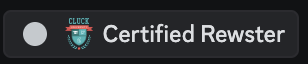
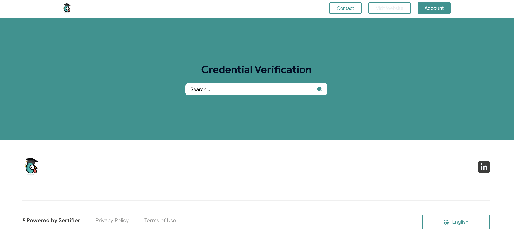
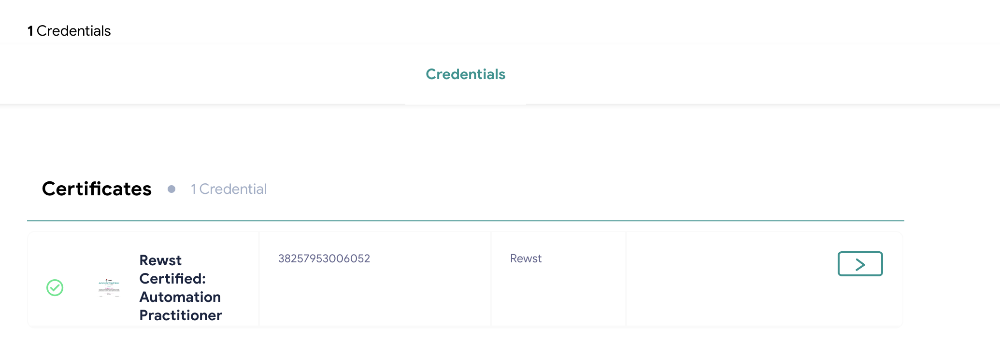
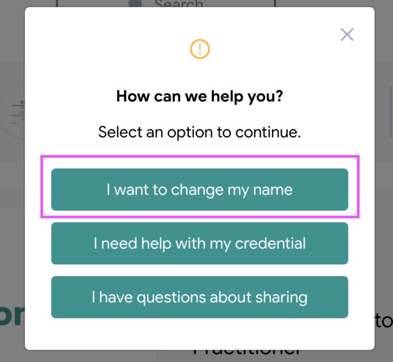
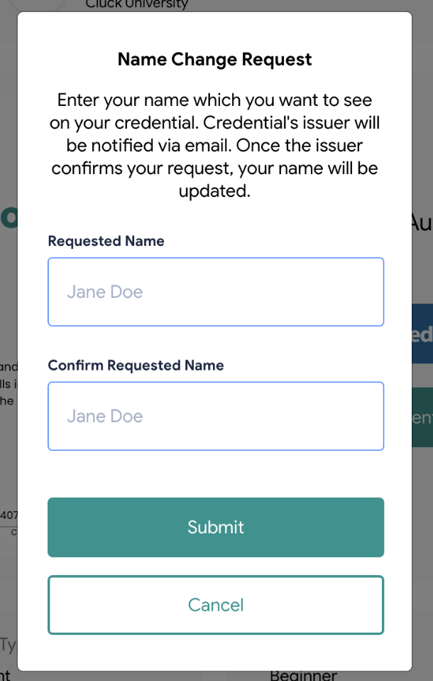

# Rewst certification how-to and troubleshooting guide


We highly recommend that all Rewst users be certified before attempting to build workflows or customize Crates. Completing proper training sets you up to succeed with Rewst, and helps prevent poorly executed workflow design. As of late 2024, some geographic locations are not yet able to participate in Rewst’s asynchronous certification process. We’re working to fix this as soon as possible.&#x20;


## Rewst certification overview

Get your Rewst Certifications! They’re badges of honor that you can wear with pride. Once you’ve completed your coursework in Cluck University, you’re eligible to take the certification exams related to each series.

Rewst offers a different certification exam for each of our two Cluck University series:

1. The Rewst Foundations Certification is an essential step in validating your skills in automating workflow processes, encompassing the knowledge from our Rewst Foundations training in Cluck University. Topics for questions include workflow mechanics, Jinja templating, API integration, task transitions, and workflow design. This certification is also what earns you your Discord badge as a Certified Rewster. More on how to take the Rewst Foundations Certification can be found in our [foundations-certification.md](rewst-foundations-1/foundations-certification.md "mention") help document.\
   \

2. The Rewst Clean Automation Certification requires knowledge and skills in applying best practice principles and avoiding anti-patterns from the courses, learned in our Clean Automation training in Cluck University. This certification aims to test you on the necessary skills and best practices for building robust, scalable, and maintainable automation workflows. More on how to take the Rewst Clean Automation Certification can be found in our [clean-automation-certification.md](clean-automation/clean-automation-certification.md "mention") help document.

## Download certificates, share certification achievement, and update certificate names

To update your own name on a Rewst certificate or share your recent certification achievement with others:

1. Go to Rewst’s credentialing site at [https://certified.rew.st/en/](https://certified.rew.st/en/) .
2.  Click into the **Credential Verification** **Search** field and enter your email address.\

    <figure><figcaption></figcaption></figure>
3.  Find the correct certificate, and click the > button.\

    <figure><figcaption></figcaption></figure>
4. Click **I want to change my name** in the new dialog that appears.
   1. Click **I need help with my credential** to reach out to the Rewst team with questions.
   2. Click **I have questions about sharing** to reach out to the Rewst team with questions.\
      
5. Fill out the name change request form.
   1. A Rewst admin will receive your request.
   2. You can expect changes to occur during our standard business hours (M-F 9am-5pm EST, excluding holidays).\
      

## Fix a missing badge or channel access in Discord

Your first step when troubleshooting your access to Rewst’s Discord server should always be to make sure that you’ve [completed our verification procedures](https://docs.rewst.help/support/roc-support/discord-join-and-verification).

If you’ve verified yourself in your server and are still missing a badge or access to a relevant channel, reach out to your CSM. They’ll work with Rewst staff to get your access squared away.
