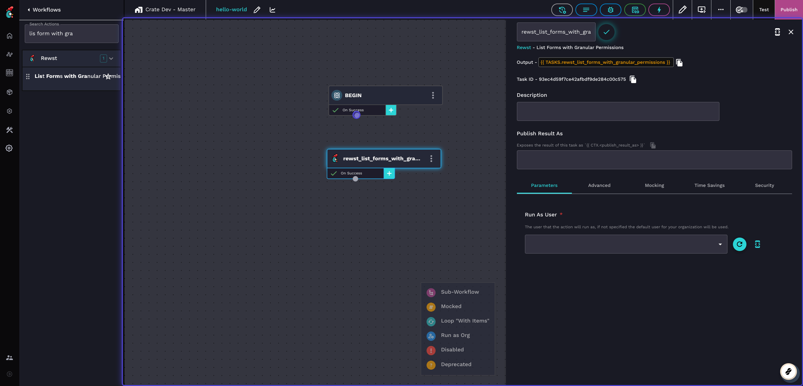

# App Builder: Overview of how to create an app


App Builder lets you build a wide variety of front-end web content to work on top of your Rewst automations. As an example, we'll show you how to create a simple Hello World in App Builder. If you need help with App Builder and your issue isn't resolved by our documentation, reach out to Rewst in your dedicated Discord support channel.


## How to create an App Builder app

1. In Rewst, navigate to **App Builder > Apps**.
2.  Click **Create New App**.\
    \


    <figure><figcaption></figcaption></figure>
3.  Enter the name of your app into the **Name** field. We'll use `hello-world` in our example. Note how it automatically creates a URL based on your org name and the rew.st domain. \
    \


    <figure><figcaption></figcaption></figure>
4. Click **Create**.

## Create a page in an App Builder app

1. Navigate to the newly created app by clicking on it in your **Apps** list. Every app's info page will contain a **Pages** section where all the default pages made by Rewst for that app will be listed. Each app you create will have both a **home** and **login** page.  Both are customizable. Note that you can only have one home and one login page per app. For more on App Builder pages, see our pages documentation [here](general/manage-your-pages.md).\


<figure><figcaption></figcaption></figure>

2\. Click **Create New Page**.

The bottom section of the **Pages** menu will consist of all non-default pages created by you.\
\


<figure><figcaption></figcaption></figure>

3\. Give your page a name. Remember that Rewst will create the url slug for that page based off this name. Choose something that makes sense, but is appropriate to be seen by the eventual audience of the page.\


<figure><figcaption></figcaption></figure>

4\. Choose a page type from the **Page Preset** drop-down selector. For this example, choose **Blank**. Other default templates include **Basic**, **Blank**, **Grid**, **Home**, and **Pricing Template**.\
\


<figure><figcaption></figcaption></figure>

5\. Click **Create**.

<figure><figcaption></figcaption></figure>

6\. Click **>** to the right of your page's record, under the **Actions** column. This will take you to the builder screen for that page.&#x20;

## Create a workflow to use in your App Builder app

### Add workflow actions

1. Navigate to **Automations > Workflows**.
2. Click **Create**.
3. Give the workflow a name that relates to your app. Here, we're using `hello-world`.


4. Add a noop action to the workflow builder canvas by clicking on the action in the left action menu and dragging and dropping it on the canvas.
5. Click on the action.
6. Click the in the action's menu.
7.  Change the name of the action to `BEGIN`, which allows other users reviewing the workflow to clearly identify the top of a workflow.\
    \


    <figure><figcaption></figcaption></figure>
8. Add a **List Forms with Granular Permissions** action to the workflow builder canvas. Find the action under the **Rewst** actions submenu. This is a prebuilt action that uses the platform's GraphQL backend to return the requested data.

9\. Connect the **Begin** action to the **List Forms with Granular Permissions** action.\
\


<figure><figcaption></figcaption></figure>

10\. In the **List Forms with Granular Permissions** action, add `all_available_forms` as the **Publish Results As** variable name. This ensures that the output of the action gets added to this variable.\
\


<figure><figcaption></figcaption></figure>

11. Under the **Parameters** tab for the action, click to open the Jinja code editor.
12. Enter `{{ CTX.user.id }}` , which uses the ID of the running user, ensuring we always get the right forms based on the logged in user.\
    \


    <figure><figcaption></figcaption></figure>
13. Return to the action's menu. Click the **Advanced** tab. Scroll down to the **Run as Org** field. Enter `{{ ORG.ATTRIBUTES.id }}` into the Run as Org box under the Advanced tab.\
    This ensures that the workflow always runs as the organization that you are logged into. If you have a form that is only enabled for certain orgs, this is how you ensure that you return the correct ones.\
    \


    <figure><figcaption></figcaption></figure>
14. Add another noop action to the workflow builder canvas. Rename the noop `set_form_output` .\
    \


    <figure><figcaption></figcaption></figure>
15. Click a data alias in this new action. Name the data alias`form_output` .\


    <figure><figcaption></figcaption></figure>
16. Click  next to your new data alias.
17. Copy the Jinja code below. Here, we're looking at all returned forms, and creating a new key with name, tags, view, and triggerId key. Eventually we'll display the name and tags to the user and use the view key to allow an action for the user - in the case of this example, go directly to the form.&#x20;

```
{#- Assumes single trigger per form -#}
{{ [
    {
      "name": form.name,
      "tags": form.tags,
      "view": "https://app.rewst.io/form/"~form.id,
      "triggerId": form.triggers[0].id | d
    } for form in CTX.all_available_forms
] }}
```

<figure><figcaption></figcaption></figure>

19. Add a final noop action to your workflow builder canvas. Rename the noop action `END`.
20. Connect **END** to the **Set Form Outputs** action.\
    \


    <figure><figcaption></figcaption></figure>
21. Click  in the top right of the workflow builder.
22. Click .png>) next to **Output Configuration**.
23. Name the output configuration`form_output`.&#x20;
24. Click  next to the output configuration to open the Jinja editor. Enter `{{ CTX.form_output }}` .&#x20;
25. Add notes to your workflow, or use RoboRewsty to do documentation for you.
26. Click **Submit.**
27. Click **Publish**.\
    \


    <figure><figcaption></figcaption></figure>
28. Click **Test**. Click **Test** again.
29. Click **View Results**.


29. Click **End**, then **output**.


30. Click **form\_output**. You'll should see a record similar to the below, with a list of the forms that have been output.&#x20;


## Add components to your app


App Builder's component library contains many pre-built components that you can drag and drop onto the App Builder canvas. Detailed information for what each component does and how to use it in your apps can be found in individual pages, in the [components.md](components.md "mention") section of App Builder's documentation.

A detailed example of one such component can best be found for our [Broken link](broken-reference "mention").


1. Navigate to **App Builder > Apps**. Click on your **relevant** app.&#x20;
2. Click  in the left side menu of the App Builder canvas. This will open the full component library.
3. Click on any component to drag and drop it into your App Builder canvas.&#x20;

## Delete an App Builder app

1. Click **App Builder > Apps i**n the left side menu of your Rewst platform.
2. Click ⋮ next to the app you wish to delete, in the table listing all your apps.
3. Click **Delete**.\
   
4. Click **I want to delete this app**.
5. Read through the warning message on the dialog that appears.
6. Click **I have read and understand these effects.**&#x20;
7. Enter the text shown on the dialog into the confirmation field.
8. Click **Delete**. If successful, a green confirmation dialog will appear at the top center of your screen.


&#x20;Once an app is deleted, it cannot be recovered. Exercise caution before deleting an app.



If you have suggestions for new App Builder features, or general feedback about your experience using this part of Rewst, submit your thoughts to our [Canny](https://rewst.canny.io/app-builder).&#x20;

