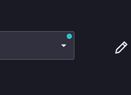

# Options filter: Filtering in forms


This Rewst feature is currently in beta! If you've come across this doc and you don't see a corresponding feature in your Rewst platform to match, stay tuned. Beta features will be rolled out to all customers after a period of testing. Thank you to our testers for their feedback.



The options filter makes customizing dropdown fields within forms straightforward for those who want to add filtering without updating an options generator workflow. It takes inputs, filters them, and produces an output agnostic of the data source.

Option generators are still a fantastic option for those who need a more powerful, in-depth, solution. We cover what these are and how to use them in Cluck U’s [Rewst Foundations](https://learn.rewst.io) and [micro course](https://learn.rewst.io). If you’ve already taken our courses and want a refresher, see our documentation on option generators [here](https://docs.rewst.help/documentation/workflows/workflow-generated-options) and [here](https://docs.rewst.help/documentation/workflows/different-types-of-workflows#option-generator).


## Options filter guidance

* Modifying a form using the options filter will work for both parent and child organizations, as long as data formatting is set up the same way for both organizations.
* You can add as many conditions as desired, but groups will be limited to 3 layers.
* Access the options filter feature in our standard form builder. Currently, it only applies to our dropdown element. If you’d like to see this feature expand to include other elements, send us feedback in our [Canny](https://rewst.canny.io/features).

## Practical uses for options filter

* Say you offer 10 different types of licenses, but your users only ever use a single Business Premium type. Filtering down to just that license would simplify the list, and leave no room for error.
* Filter out admins from a total list of users, to create a cleaner list for copying into user onboarding.
* When offboarding a user, you may want to exclude a list of specific people to prevent accidental offboarding of key individuals, like the CEO.
* Hide on.microsoft email domains that are purely administrative, to provide a cleaner list.

## Options filter dialog

In the dialog, you’ll see two submenus: **Dropdown Options** and **Options Filter**.

### Dropdown Options menu

The **All Options** drop-down selector holds all of the options which you’ve set in the standard form builder right side menu. Adding more options in that menu will populate those options into your drop-down selector.

<figure><figcaption></figcaption></figure>

<figure><figcaption></figcaption></figure>

The Filtered Options drop-down selector holds a list of your selected options after applying the filter. It acts as a preview for what to expect from your filtering.

<figure><figcaption></figcaption></figure>

If a drop-down uses a custom options filter, there will be a badge indicator in the top right of the drop-down field.

<figure><figcaption></figcaption></figure>

#### The JSON interface

Toggle from the default **Simple** view to the **JSON** view. This will switch to show the code of the filter. You may have a scenario where your desired filter is more complex than just label and value, such as ID. Using this code editor, filter out custom objects from complex queries.

<figure><figcaption></figcaption></figure>

### AND and OR conditional options filtering


Using the options filter for forms will require a basic understanding of Boolean. If you’re new to the topic, be sure to complete our Clean Automation course in Cluck University before trying out this feature.


The options filter works off of two boolean operators, which are used to build queries for a variety of filtering situations.

1. **AND** sets that all conditions must be true to be filtered into the returned result. E.g., Red AND white would count only items with both those characteristics.
2. **OR** sets that either of several conditions can be true to be filtered into the return result E.g., Red OR white would count items with either of those characteristics.

<figure><figcaption></figcaption></figure>

Click **X** to the right of any added rule or group to delete it from your options filter list.

Clicking **+Rule** adds a filter field, which is customizable by a list of parameters. Choose from either **$.value** or **$.label**, then choose from the long drop-down list of conditions. E.g., **$.value equals `15`** would filter all results with a value of exactly 15.

<figure><figcaption></figcaption></figure>

In Boolean logic, a _group_ refers to a set of terms or expressions that are treated as a single unit by using parentheses, allowing you to perform Boolean operations on them together. Essentially, it defines the order of operations by grouping certain elements within a complex logical statement.

When you want to combine multiple Boolean operations in a specific way, you enclose them within parentheses to indicate that these operations should be calculated first.

By grouping terms, you can control the order in which Boolean operators like AND and OR are applied. Use the +**Group** button to define your conditions more precisely. For example:

* Without grouping, A OR B AND C would be evaluated as: A OR (B AND C) due to precedence rules
* With grouping, (A OR B) AND C forces OR to be evaluated before AND.

## Use the options filter in a form

1. Create a new form by navigating to **Automations > Forms > + Add**.
2. Name your form, and click **Submit**.
3. Drag a **Dropdown** element onto the form builder canvas. Remember, options filter is currently only available for this element of the form builder.
4. Click on the element to open the right side menu.
5. Click on **Filter Options**. This will open the **Create Option Filters** dialog.

<figure><figcaption></figcaption></figure>

6. Set up your desired filters using the AND and OR options, with relevant use of the **+Rule** and **+Group** buttons.
7. Click **Close** when finished. The option filter will automatically save and be applied to your form. Note that you’ll still need to click **Save** at the top right of your form builder screen to update these changes within your form.

## Options filter and syncing of forms

The greatest advantage of the options filter is that it allows for the overriding of a form. Synchronized forms will block you from modifying attributes to prevent sync malfunction, by default. Under filter options in the form builder, you’ll find an **Override** button at the bottom right. Clicking will override this individual filter. Note that if you have multiple filters, and want to modify all of them, you’ll need to click **Override** for each filter.

<figure><figcaption></figcaption></figure>
