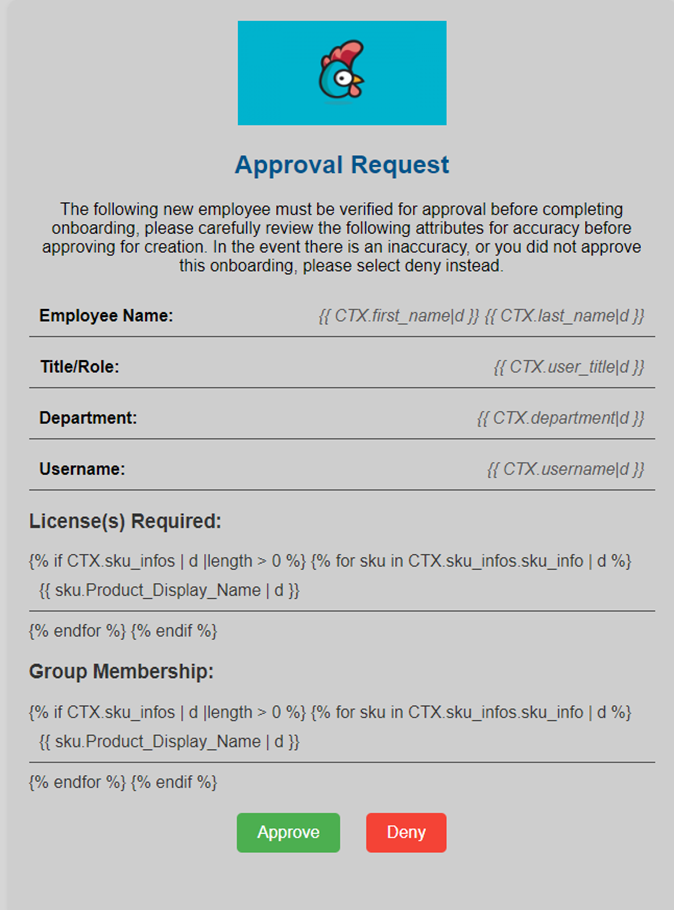
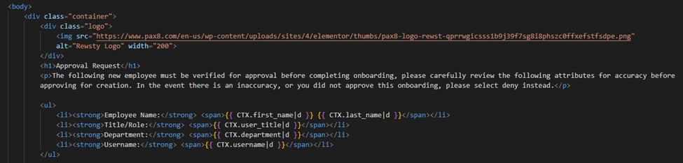

# Send mail as an impersonated user using Microsoft Graph API

Take control of your email appearance by using the Microsoft Graph API to send emails for you. Upload your own HTML templates into Rewst, and use them with the Microsoft Graph action. In the template, reference variables from the workflow to report on data gathered from workflows. The HTML Template lets you brand the email with your own custom logos and styling.

## Prerequisites for impersonated email send

* The [Microsoft Cloud Integration Bundle](https://app.rewst.io/organizations/b6e6c7b9-ff6e-4fff-a875-dfcb6ffc2c2d/integrations/bundles/microsoft_cloud) must be setup, and working.
* The user selected to send the email must exist in the Microsoft365 tenant called in the workflow.


A note about customer context:

If the workflow is running in the customer child organization, you can't send the email from the top level (MSP) domain. The email you send from needs to exist in the tenant the call is being made from. This can make implementing the graph send mail challenging for some workflows. If needed, you can do this by using completion handlers to send the email, instead of doing it within the primary workflow. This will allow you to send from the top level domain, regardless of the context the workflow runs in.


## Set up the Microsoft Graph Send Mail action

1. Navigate to **Automations > Workflows** **> Your desired workflow** in the left side menu of your Rewst platform.
2. In the workflow builder, search for the action `send mail as impersonated user`.\
   \
   
3. Drag the Microsoft Graph action onto the canvas.&#x20;
4.  Fill out the required parameters, including:

    1. Subject
    2. User ID (AAD ID of sender)
       1. We recommend you set this as an Organizational variable
    3. Message Content
       1. HTML Templates can be used here, as well as plain text
    4. Message Content Type
       1. This should match the type of the above content
    5. To Recipient
       1. An array of recipients

    Other optional parameters include but are not limited to:

    * File attachments
      * Base 64 encoded file attachments. This could be a CSV generated by the workflow
    * Read Receipt
    * CC & BCC
    * Reply To

<figure><figcaption>
Find the parameters menu on the  right side of your screen.
</figcaption></figure>


**Tips**

* When used in conjunction with our core create webhook and await webhook actions, you can embed webhook links in the HTML message template for approval-related tasks.
* Use free tools such as VS Code to render HTML for testing and creating templates.
* Use Jinja in the HTML template to render data contained within the workflow.


## Example HTML template for new user approval

<figure><figcaption></figcaption></figure>

You can embed your own logos in the HTML template. For example, the Rewst logo above is coded in the body:

<figure><figcaption>
Example HTML, with logo embedded in the code
</figcaption></figure>

## Microsoft Graph error when using Send Mail as an impersonated user

When you are trying to use the Send Mail action as an Impersonated user, you may receive the following error message: **The specified object was not found in the store., The process failed to get the correct properties.**

This error likely indicates a permissions issue. When you send mail via this endpoint, there are a few factors that come into play.

1. Sending via **delegated permissions does not work** and it must be done via **application permissions**. While you can technically get it to send with delegated permissions, the call would have to be to the local tenant and the user used to authorize the action would need to be granted permissions to the user's mailbox.\
   When using Rewst and sending this call from the MSP tenant, it's going to use application permissions. But if the call is done with CSP, it's going to use delegated authentication, meaning access to an external user/identity mailbox will not be granted.
2. When making the call through an application context the Rewst Application must have Send.Mail as an application permission.

## Resolve the Send Mail as an impersonated user issue

1. Log in to Microsoft Entra in the MSP tenant.
2. Verify that the permission shows in the **Permissions** page for the Rewst Prod enterprise app.
3. Click **Grant Admin Consent** if the permission is missing.
4. Follow the wizard for granting consent.
5. Verify that permission now exists.
6. Test the workflow in Rewst. If successful, stop here.&#x20;

If the test is unsuccessful then follow these next steps:

1. Re-authorize the CSP integration.
2. Re-authorize the Graph integration without the **CSP delegation** slider checked.
3. Re-authorize the Graph integration with the **CSP delegation** slider checked.
4. Repeat these re-authorization steps for the Exchange Online integration.

