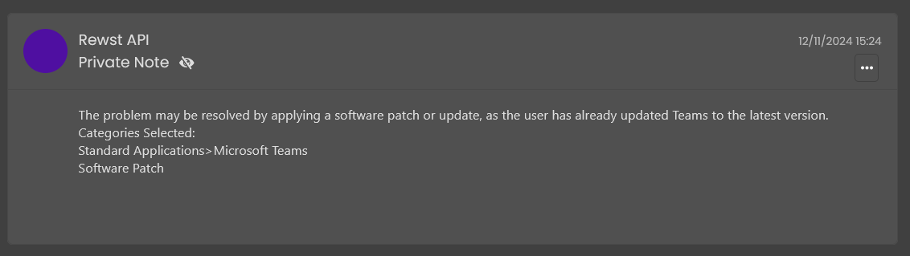

# AI Ticket Categorization Crate


For users of Azure OpenAI instance

Note that this Crate works for both OpenAI and OpenAI with an Azure instance.\
In order to use the Azure instance, you will need to follow the [Azure OpenAI Integration Setup](../../configuration/integrations/integration-guides/openai/azure-openai-integration-setup.md) steps and follow the below steps.\
If you’re new to Crates, read through our introductory Crate documentation [here](https://docs.rewst.help/prebuilt-automations/crates). Find the Crate in our Crate Marketplace.


## What does the AI Ticket Categorization Crate do?

This Crate uses AI to automatically determine the best categorization for newly created PSA tickets. Once a category is identified, the Crate updates the ticket with the suggested categorization, simplifying ticket management and improving organizational efficiency.

* Choose the AI model to use for ticket analysis, as this Crate works with both OpenAI and Anthropic.
* Customize AI's maximum tokens used using [organization variables](openai-ticket-categorisation-setup.md#organization-variables-associated-with-this-crate).
* Enable or disable error reporting directly on the ticket.

This Crate does not resolve tickets or make changes outside of categorization. It strictly assigns ticket types based on ticket details and records notes for reference. Any further ticket modifications or actions must be handled manually.

### How the Crate works

The Crate workflow is triggered by a **webhook** whenever a new ticket is created in the PSA system.

* It collects ticket details, such as ID, title, and description, to prepare for categorization.
* AI recommends the most suitable ticket type and subtype based on the content and context of the ticket.
* The workflow updates the ticket type and leaves an internal note summarizing the analysis results and documenting any errors or issues.

### Workflow breakdown

1. The workflow begins with the **START** task using the **noop** action, which establishes the defined PSA by checking context variables and organization defaults.
2. The **check\_default\_psa** task using the **noop** action validates that a PSA is configured, either from context or organization variables, and routes to failure if no PSA is found.
3. The **set\_model** task using the **noop** action configures the AI model settings, determining which model to use based on organization variables or defaults, and sets up token mapping for the selected model.
4. The **is\_model\_set** task using the **noop** action verifies that an AI model has been properly configured and routes to failure if no model is detected.
5. The **get\_max\_tokens** task using the **noop** action retrieves the maximum token limit for the AI model from organization variables or predefined model limits.
6. The **is\_max\_tokens\_set** task using the **noop** action checks if max tokens are configured and either proceeds or logs a warning about potential issues.
7. If max tokens are not set, the **max\_tokens\_not\_set** task using the **noop** action logs a warning message about the missing configuration.
8. The **get\_ticket\_variables** task using the **\[REWST - TASK] AI:Format PSA Ticket Variables** action extracts and formats ticket information including ID, title, description, and queue from the trigger data.
9. The **get\_note** task using the **\[REWST - TASK] PSA:Get Note Information** action retrieves additional ticket note information and user messages from the PSA system.
10. The **get\_types\_and\_subtypes** task using the **\[REWST - TASK] Get Ticket Types** action fetches available ticket types and subtypes from the PSA based on the ticket queue.
11. The **get\_openai\_data** task using the **\[REWST - TASK] Select AI Prompt Provider** action sends the ticket information to the AI service for categorization analysis and receives structured categorization results.
12. If the AI returns an error, the **set\_error\_ticket\_note** task using the **noop** action prepares error information for ticket notation.
13. The **update\_ticket\_type** task using the **\[REWST - TASK] OpenAI Update Ticket Type** action applies the AI-determined categorization to the ticket, updating type, subtype, and category fields in the PSA.
14. The **set\_ticket\_note** task using the **noop** action prepares the categorization reasoning for addition to the ticket as an internal note.
15. The **list\_errors\_in\_ticket** task using the **noop** action determines whether error information should be added to the ticket based on configuration.
16. If errors should be shown, the **update\_ticket\_note** task using the **\[REWST - TASK] Update Ticket Internal Note** action adds the categorization reasoning or error information as an internal note to the ticket.
17. If ticket updating is disabled, the **ticket\_error\_updating\_disabled** task using the **noop** action provides a bypass path.
18. Any failures in the process route through the **failed** task using the **noop** action, which consolidates error handling.
19. The workflow concludes with the **END** task using the **noop** action, which compiles all logging information and generates the final automation log with status codes, success indicators, and detailed execution results.

## Crate prerequisites

*   Before unpacking the Crate, you'll need to have the integration for one of the following PSAs set up:

    * [ConnectWise PSA](../../configuration/integrations/integration-guides/connectwise-integration-setup.md)
    * [Datto PSA](../../configuration/integrations/integration-guides/datto-psa-integration-setup/)
    * [HaloPSA](../../configuration/integrations/integration-guides/halo-integration-setup.md)
    * [Kaseya BMS](../../configuration/integrations/integration-guides/kaseya-bms-integration-setup.md)

    If you're using a PSA that isn't on this list, please let us know. Our support team will look at whether it has the ability to trigger an automation based on a ticket being created.
* You'll also need to have the one of the following AI integrations set up in Rewst before unpacking this Crate:
  * [OpenAI](../../configuration/integrations/integration-guides/openai/openai-integration-setup.md)&#x20;
  * [Anthropic](../../configuration/integrations/integration-guides/anthropic-integration.md)
* Remember, you can also set up an Azure instance of OpenAI, and use that with this Crate. If you want to use an Azure instance of OpenAI with this Crate, you'll need to follow the Azure OpenAI Integration Setup steps to have this completed before unpacking.

## Unpack the OpenAI Ticket Categorization Crate

1. Navigate to **Crates** > **Crate Marketplace** in the left side menu of the Rewst platform.
2. Search for `AI Ticket Categorization`.\
   \
    
3. Click on the Crate tile to begin unpacking.
4.  Click **Unpack Crate.** 

    <figure><figcaption></figcaption></figure>
5. Choose your desired PSA from the drop-down selector. This is especially important for customers using multiple PSAs.&#x20;
6. Choose the AI provider that you wish to use from the drop-down selector.&#x20;
7. Choose the AI provider again in the **AI Provider** drop-down selector. Choose the **AI Model** of that provider that you would like to use with the Crate.&#x20;
8. Choose if you would like to **Report errors in ticket when unable to utilize AI**.
9. Click **Continue**.
10. Triggers for all possible PSAs are included in this Crate. By default, they're disabled, and only the PSA indicated by your choice in the drop-down selector used in the previous step will be enabled.

<figure><figcaption>
Disable the unused triggers
</figcaption></figure>

<figure><figcaption>
Enabled Trigger
</figcaption></figure>

### Test the Crate

Create a ticket in your PSA with a typical description and summary.

<figure><figcaption></figcaption></figure>

## Organization variables associated with this Crate


For more on organization variables and how to use them, see our org variable documentation [here](https://docs.rewst.help/documentation/configuration/organization-variables).

Organization variables not found in our standard organization variables documentation, such as the ones listed below. are typically system variables that are handled by integration mappings.

If you haven't done so already, we recommended that you run the [Configure Organization Variables Crate](https://docs.rewst.help/documentation/crates/existing-crate-documentation/configure-organization-variables), which will help you set org variables that are relevant to you and your customer's environments.


These organization variables give you more control over the functionality of this workflow.

* `ORG.VARIABLES.ticket_cat_max_tokens` - Allows you to manually set the max tokens
* `ORG.VARIABLES.ai_model_ticket_cat` - Allows you to manually set the model

## Increase the success rate of categorization

* Creating more types, subtypes, and items in your PSA will give OpenAI more choices to choose from to better fit the response.
* Choosing a different model may improve your response. Note that different models have different price points. See more on OpenAI's model pricing [here](https://openai.com/api/pricing/).&#x20;


Got an idea for a new Crate? Rewst is constantly adding new Crates to our Crate Marketplace. Submit your idea or upvote existing ideas here in our [Canny feedback collector](https://rewst.canny.io/crates).

