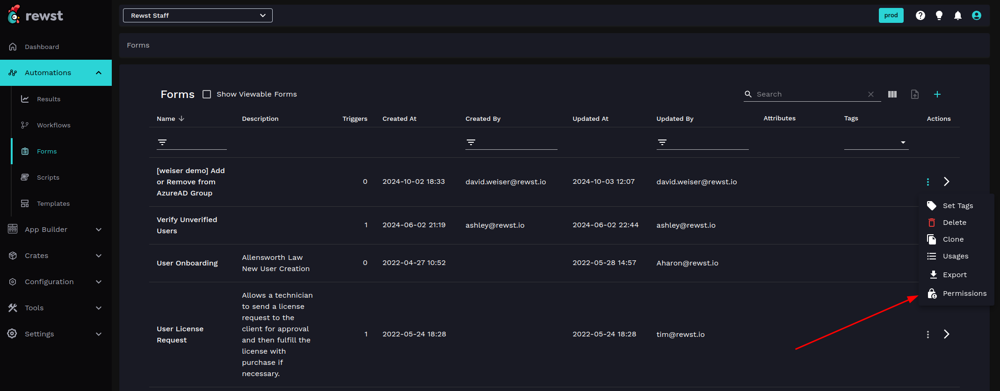

# Form permissions


Note: Only Rewst users with the admin role can modify form permissions. For more on roles in Rewst, see our existing documentation here: [https://docs.rewst.help/documentation/user-management/roles](https://docs.rewst.help/documentation/user-management/roles)


### Permission levels

Choose from three levels of permissions for each of your users in Rewst.

1. **Members** can:
   * View the form
   * Submit the form if their assigned role has the `rewst.form.view` permission
2. **Editors** can:
   * Edit the form
   * Update form content
   * Set form tags
   * Clone the form
   * Complete all actions allowed for Members
3. **Owners** can:
   * Have full control over the form
   * Delete the form
   * Complete all actions allowed for Editors

### Modify form permissions

1. Navigate to **Automations** > **Forms** in Rewst.
2. Select the form you want to modify by clicking ⋮ in the **Actions** column.
3. Click on **Permissions** in the menu that appears.

<figure><figcaption></figcaption></figure>

4.  The Permission dialogue holds two possible actions:\

    <figure><figcaption></figcaption></figure>

    1. Adjust your form’s permissions as desired, based on roles.
       1. Each of the tabs at the top of the dialogue represents a form permission level. By default, the **Member** permission level is set to include **Forms** and **Read Only** roles in Rewst, and **Editor** and **Owner** permission levels are set to include whichever roles are included in the **Member** permission.
       2. Add your desired roles to your choice of permission level via the **Roles** drop down menu of that permission level tab. Note that if you wish to grant a permission level to a custom role, that role will need to be setup first in the **Settings** menu of Rewst.
       3. By default, the form's owning organization is selected and will appear in the **Organizations** field. Currently, access control is limited to this organization.
       4. Specify suborganizations in the **Organizations & All Suborganizations** field by selecting your desired suborganizations from the drop down menu.
       5. Exclude organizations in by selecting your desired organizations from the **Exclude Organizations** drop down menu.
    2. The **Check Authorization** accordion can be used to determine the existing level of access a user has to the form. To do so:
       1. Expand the **Check Authorization** accordion.
       2. Choose the **Organization** of the user.
       3. Choose the **User**.
       4. Choose the **Relation.**
       5. **Check** for access: _E.g., Does user 2459 have member access to this form?_ The answer will appear at the bottom of the accordion.
       6. **Update** to save your changes.


Note: If your form permissions are set prior to a new user being given a role in Rewst, that new user will automatically inherit the pre-set form permissions of their role.


