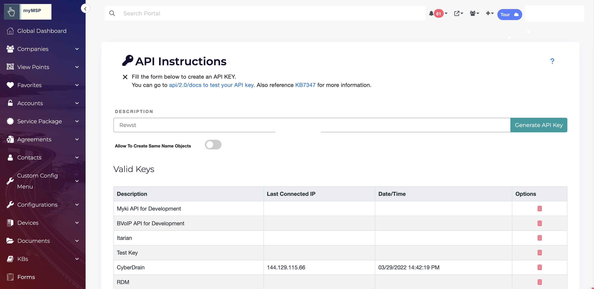

# IT Portal integration setup

1. Log in to IT Portal with your credentials.
2. Click your **name** at the top right corner.
3. Select **Admin Settings** from the dropdown menu.
4.  Select the option to **Generate API Key** under the **Security** section.\
    \

    <figure><figcaption></figcaption></figure>
5. Enter a description for the API key (e.g., **R-E-W-S-T**).
6. Turn off the option **Allow to create same name objects**.
7.  Click **Generate API Key**.\
    \

    <figure><figcaption></figcaption></figure>
8. Copy the new API key, once created.
9.  Navigate to the Rewst IT Portal configuration form and paste the copied API key.\
    \

    <figure><figcaption></figcaption></figure>
