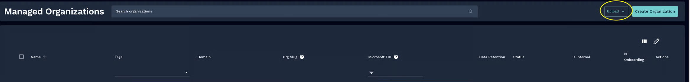

# Organizations


Before editing anything in this section of Rewst, be sure to read up on our introductory documentation on organizations and organization variables [here](https://docs.rewst.help/documentation/organization-variables#what-is-an-organization).


## Rewst onboarding preliminary organization import - CSV


These steps will work for any MSP, regardless of the tools your company uses.

Tag names must already exist in Rewst before the file import.


1. Navigate to **Settings > Organizations**.
2.  Click **Upload > Upload CSV**. 

    <figure><figcaption></figcaption></figure>
3. Click **Download CSV template** in the import dialog. The template defines the expected columns and format for proper import into Rewst.\
   \
   
4.  Fill out the template with your customer organization data to correspond with the template headers. Rewst limits the size of your CSV to 1,000 organizations per upload. MSPs with more than 1,000 organizations should split their data across multiple files and uploads.\
    Headers:

    * **organizationName**, max 255 characters, required — The customer org name, which must be unique within the managing org hierarchy. It can't be a reserved name. This is the only mandatory field.
    * **managingOrgId**, optional— This is the UUID to override the default managing organization on a per-row basis. Find the UUID in one of two ways:
      * When you navigate to that specific organization, you will see the UUID in the browser’s URL bar.
      * Within a Workflow, you can use the [Rewst: List Organizations action](../automations/actions-in-rewst/rewst-actions.md#list-organizations-action). This will return a list of all organizations in their Rewst instance. Each object in the response includes the UUID, name, managing\_org\_id, and other details.
    * **domain,** max 255 characters, optional— This refers to the customer domain, which must be checked for uniqueness.
    * **orgSlug,** max 255 characters, optional — This is the identifier for Rewst's [App Builder](../app-builder/), and is auto-generated if not provided. If you're unsure if you want to use App Builder at the time of import, you can manage the orgSlug through the organizations page at a later time.
    * **isEnabled**, optional— Boolean, defaults to `true` if not specified in your CSV.
    * **tagNames**, optional — Use this for comma-separated tag names to apply. If you use this column, be sure to [add the corresponding tags](tags-in-rewst.md) in Rewst before uploading your file 

    <figure><figcaption></figcaption></figure>
5. Return to Rewst. Upload your completed CSV file via the upload dialog.
6. Rewst will validate every row and process the import. After processing, Rewst will display a summary of the results. Note that this summary can only be viewed once.
   1. Records are categorized as Imported, Skipped, or Failed.&#x20;
   2. Individual record failures won't block the rest of the import.
   3. If you experience import failures, download the log, use that as a reference to update the records in your original file, then upload again. Or, alternatively, [manually add the failed organizations to Rewst](organizations.md#manually-create-a-new-organization-in-rewst).

<figure><figcaption>
An example of the import summary
</figcaption></figure>

### CSV upload error codes


Uploads that don't match the expected schema will fail validation.


| Error Code                          | Field                                      | When It's Triggered                                                                                                                                                  |
| ----------------------------------- | ------------------------------------------ | -------------------------------------------------------------------------------------------------------------------------------------------------------------------- |
| **REQUIRED\_FIELD**                 | `organizationName`                         | Name is missing or empty after trimming whitespace                                                                                                                   |
| **MAX\_LENGTH\_EXCEEDED**           | `organizationName`, `domain`, or `orgSlug` | Any of these fields exceed 255 characters                                                                                                                            |
| **INVALID\_FORMAT**                 | `managingOrgId`                            | The managing org ID is not a valid UUID - `xxxxxxxx-xxxx-xxxx-xxxx-xxxxxxxxxxxx`                                                                                     |
| **NOT\_FOUND**                      | `managingOrgId`                            | The managing org ID is a valid UUID but doesn't match any organization in the database                                                                               |
| **UNAUTHORIZED**                    | `managingOrgId`                            | The user doesn't have management access or staff write access to the specified managing org                                                                          |
| **DUPLICATE\_IN\_FILE**             | `organizationName`                         | Two or more rows in the same import have the same org name (case-insensitive). Reports which earlier row it duplicates.                                              |
| **DUPLICATE\_IN\_DATABASE**         | `organizationName`                         | An org with the same name (case-insensitive) already exists under the target managing org's hierarchy. Record is categorized as `EXISTING` and skipped (not failed). |
| **RESERVED\_NAME**                  | `organizationName`                         | The name contains a substring reserved for Rewst staff - only enforced for non-staff users, via `validateOrganizationName`                                           |
| **INVALID\_SLUG**                   | `orgSlug`                                  | The slug fails `validateSiteDomain` validation - forbidden domains, format issues, etc.                                                                              |
| **INVALID\_TAGS**                   | `tagNames`                                 | One or more tag names don't match any existing tags for the managing org or global tags                                                                              |
| **DUPLICATE\_DOMAIN\_IN\_FILE**     | `domain`                                   | Two or more rows in the same import have the same domain, which is case-insensitive. Reports which earlier row it duplicates.                                        |
| **DUPLICATE\_DOMAIN\_IN\_DATABASE** | `domain`                                   | An org with the same domain already exists under the managing org's hierarchy                                                                                        |

## Rewst onboarding preliminary organization import - PSA


Currently, Rewst's import-from-PSA feature supports three brands of PSA:

* ConnectWise PSA
* Datto Autotask PSA
* HaloPSA

Your PSA must successfully be integrated with Rewst before attempting the import. If your brand of PSA isn't on this list, use the [Bulk Create Clients from PSA ](../crates/existing-crate-documentation/bulk-create-client-from-psa-crate.md)Crate or the Upload CSV import method as alternatives.&#x20;


This import method allows you to pull customer organizations directly from a connected PSA integration and import them into Rewst, without exporting or uploading a file. Unlike our Crate import processes, PSA import doesn't consume workflow tasks, and organization mappings are created automatically as part of the process. Rewst limits the size of your import to 1,000 organizations per import execution. MSPs with more than 1,000 organizations should split their data across multiple import jobs. 

1. Navigate to **Settings > Organizations**.
2. Click **Upload > Import from PSA**.

<figure><figcaption></figcaption></figure>

3.  Choose your configured PSA from the list in the dialog. If you use more than one PSA, multiple options will appear. Only integrations that are eligible, installed, and configured are selectable.&#x20;

    1. **Green** - selectable: The PSA is installed, configured, and healthy. You can select a PSA and continue with the import.
    2. **Orange** - disabled: The PSA is installed but not fully configured or has some sort of failure. Address your PSA's issues before resuming the import.
    3. **Red** - disabled: The PSA is installed and configured, but is not connected. Verify the settings to resolve this to a Green status.&#x20;

     
4. Click **Continue**.
5. Rewst will fetch your PSA's customer list. Use the search and filter controls to select the organizations you want to import.
   1. Type in the **search** field to filter by customer name.
   2. Filter by the **Customer Status** drop-down selector: Such as Active, Inactive
   3. Filter by the **Customer Type** drop-down selector: Such as Customer, Prospect, Vendor, etc.\
      \
      
6. Click **Import.** Rewst validates and creates the selected organizations. While importing, you can watch the progress on your screen. Don't close the tab. This will cancel the import.&#x20;
   1. Each imported organization is automatically linked back to its PSA record via an [organization variable](../integrations/organization-variables.md#what-is-an-organization-variable). You don't need to manually configure organization mappings after import.
   2. Organization names must be unique. No duplicate names may exist within the import or database, and you can't use no reserved names. The maximum for each name is 255 characters.
   3. All imported organizations default to enabled - `isEnabled: true`.
7. After processing, Rewst will display a summary of the results. Note that this summary can only be viewed once.&#x20;
   1. Records are categorized as Imported, Skipped, or Failed. The **Issues encountered** summary will list out the organizations that were unsuccessful, with a reason for why Rewst failed on its import. Skipped organizations already exist in Rewst, and are not imported to avoid duplicate org creation.
   2. Individual record failures won't block the rest of the import.
   3. If you experience import failures, click **Download Log** to download the log to a CSV file and view the cause of failures. Then, [manually add the failed organizations to Rewst](organizations.md#manually-create-a-new-organization-in-rewst).
   4. Click **View Organizations** to close the summary and return to the refreshed organizations table in Rewst.
   5. Click **Import More** to start another import.\
      \
      

### PSA import error codes


Uploads that don't match the expected schema will fail validation.


| Error Code                  | Field                                      | When It's Triggered                                                                                                                                                  |
| --------------------------- | ------------------------------------------ | -------------------------------------------------------------------------------------------------------------------------------------------------------------------- |
| **REQUIRED\_FIELD**         | `organizationName`                         | Name is missing or empty after trimming whitespace                                                                                                                   |
| **MAX\_LENGTH\_EXCEEDED**   | `organizationName`, `domain`, or `orgSlug` | Any of these fields exceed 255 characters                                                                                                                            |
| **DUPLICATE\_IN\_DATABASE** | `organizationName`                         | An org with the same name (case-insensitive) already exists under the target managing org's hierarchy. Record is categorized as `EXISTING` and skipped (not failed). |
| **RESERVED\_NAME**          | `organizationName`                         | The name contains a substring reserved for Rewst staff - only enforced for non-staff users, via `validateOrganizationName`                                           |

## Manually create a new organization in Rewst


Remember, organizations are divided up into parent and child organizations. Every new customer you onboard into Rewst will need its own separate child org.


1. Navigate to **Settings >** **Organizations** in the left side menu of the Rewst platform.
2. Click **Create Organization**.\
   ![A modal window titled “Create a New Organization” within a dark-themed user interface. The form includes several input fields:  A checkbox labeled “Enabled” (checked by default)  A required “Name” field marked with a red asterisk  “Org Slug” field  “Domain” field  “Microsoft Tenant ID” field  A dropdown labeled “Managing Organization ID” with the value “Real Fake Customer” preselected  At the bottom of the form are two buttons: a “Cancel” link and a pink “Submit” button. All input fields are styled with a dark background and light text.](<../../.gitbook/assets/Screenshot 2025-04-22 at 12.05.55 PM.png>)
3. Fill out the following fields in the **Create a New Organization** dialog that appears:
   1. **Name**: This is the display name for the organization - keep it short and recognizable, and avoid special characters
   2. **Org Slug**: This is auto-generated and becomes part of the URL and internal references, but you can edit it -use lowercase and dashes only
   3. **Domain**: Leave this field blank
   4. **Microsoft Tenant ID**: Don’t edit this field, but note that what happens to it will depend on your tooling:
      1. If you use Microsoft, Rewst’s integration will auto-populate this field when customers are linked
      2. If you don’t use Microsoft, this field will remain blank
   5. **Managing Organization ID**: This drop-down selector will auto-populate based off of your Rewst setup, and may just be one option to reflect your parent organization
4. Click Submit.

## Edit an organization

Once an organization is created, it will appear in the organizations list of this organizations menu, as well as the drop-down organizations selector in the top right of the Rewst platform.

<figure><figcaption>
Click ⌄ to expand your organization selector
</figcaption></figure>

Click  next to your desired organization in the organization list to open the fields of that organization’s record for editing. From this list view, you can also choose to add tags to your organization via the **Tags** drop-down selector. For more on tags, see our documentation [here](https://docs.rewst.help/documentation/settings/tags-in-rewst).

## Delete an organization


Once an organization is deleted, it can’t be brought back, even by Rewst support. Make sure that you intend to delete an organization permanently before proceeding with the following steps.


1. Check off the box next to the organization you wish to delete.
2.  Click **Delete Organization(s)** in the top right corner.\
     

    <figure><figcaption>
Delete organizations will only appear once an org has been selected
</figcaption></figure>
3. Confirm that you wish to delete the organization. Type `delete orgs` into the field.\
   \
   
4. Click **Submit**.
5. A green confirmation message will appear once the deletion completes.\
   

## Rewst data retention


For more on how to view workflow execution logs, see our workflow documentation [here](https://docs.rewst.help/documentation/workflows/workflow-builder-how-to-set-up-a-workflow).


Rewst retains workflow execution for a configurable number of days, up to 30 days maximum. Logs are expunged nightly according to the retention period. The default each account is set to at the time of creation is 21 days.

Access data retention settings in the Rewst platform by navigating to **Settings > Organizations**. Note that only users with the admin role will be able to update this setting. 

<figure><figcaption>
The organizations list page
</figcaption></figure>

Click  next to each individual organization to edit the settings for that organization.

Settings for data retention are stored per organization. Setting a retention period preference at the parent organization level won’t create inherited permissions for all child organizations. Instead, if you want all organizations to have the same data retention period, use  to edit all managed organizations at once.\

