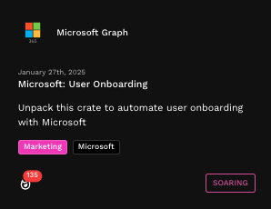
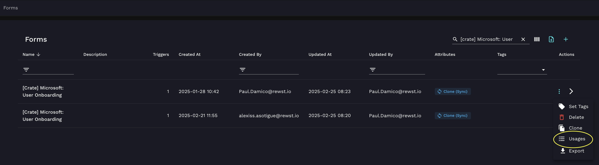
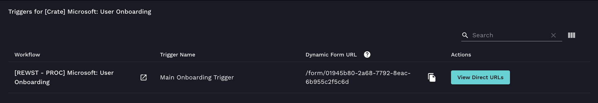

# Microsoft: User Onboarding Crate V2


This Crate is a big one! Unlike most of our other Crates, our documentation for the Microsoft: User Onboarding Crate is spread over several pages. Look in the left side tree of the navigation menu for our documentation site, and click through the pages nested under this one to see all related documentation.


## **What does the Microsoft: User Onboarding Crate do?**

The Microsoft: User Onboarding Crate automates the user onboarding process by streamlining account creation, group assignments, licensing, and additional configurations across Microsoft Entra ID, formerly known as Azure AD, and on-premises Active Directory.

Ensure that new employees or contractors are provisioned accurately and consistently based on predefined policies, integrating seamlessly with PSA, RMM, documentation, and licensing systems.

## **Why use the Microsoft: User Onboarding Crate?**

This Crate is ideal for MSPs and IT teams managing Microsoft environments.

* Standardized onboarding: Automates user creation, group assignments, and licensing
* Multi-environment support: Configures On-Prem AD, Azure AD, or Hybrid environments
* License and group management: Assigns Microsoft 365 licenses, security groups, and shared mailboxes
* Security and compliance: enforces password policies, role-based access, and MFA registration
* Automated documentation: logs user details in PSA (Professional Services Automation) and external documentation platforms
* Automated ticketing: creates or updates tickets or sends emails
* Approval workflow: Requires manual approval before provisioning users

## Supported configurations

Multi-environment support: Identity providers

Defines how users are created and managed across Active Directory and Azure AD.

* On-Prem AD Only – Users exist only in on-prem Active Directory, with no cloud integration.
* Azure AD Only – Users are created directly in Microsoft Entra ID (Azure AD), without an on-prem AD account.
* Hybrid with AD Sync – Users are created in both AD and Azure AD, synchronized via AD Connect.
* Hybrid with No AD Sync – Users are manually created in both AD and Azure AD, without synchronization.

Ticket creation: supported PSAs

Lists the PSA tools that support ticket creation.

* ConnectWise PSA – A popular PSA solution for IT service management.
* Datto Autotask PSA – Cloud-based PSA software designed for MSPs.
* Freshdesk – Customer support and ticketing platform.
* HaloPSA – IT service management platform with automation and reporting.
* Kaseya BMS – Business management solution for MSPs.
* ServiceNow – Enterprise IT service management and workflow automation.
* Email Only – Ticket creation via email, without PSA integration.

Active directory configurations: Supported RMMs

Lists the Remote Monitoring and Management (RMM) tools necessary for retrieving data from Active Directory.

* ConnectWise Automate – RMM platform for remote monitoring and automation.
* Datto RMM – Cloud-based RMM for endpoint management and automation.
* NinjaOne – IT management platform for monitoring and remote access.
* ImmyBot – Automated deployment and configuration management tool.
* ConnectWise Control – Remote support and remote access solution.
* Kaseya VSA – IT automation and RMM tool for IT professionals.
* Kaseya VSA X – Next-gen version of Kaseya VSA with enhanced capabilities.
* N-able N-central – RMM platform for endpoint and network management.
* Agent Smith – RMM tool for system automation and monitoring.

IT documentation platforms and password management systems

Tools used for IT documentation and secure password storage.

* Hudu – IT documentation and password management platform for MSPs.
* IT Glue – Documentation platform with password vault and automation features.

Automatic licensing: supported distributors

Lists distributors that support automatic license provisioning for Microsoft CSP and other software.

* Microsoft CSP Direct – Direct Microsoft Cloud Solution Provider.
* Pax8 – Cloud distributor specializing in SaaS solutions for MSPs.
* Ingram Micro – Global IT distributor with cloud services.
* Sherweb – Cloud solutions provider with Microsoft licensing.
* Synnex – IT distributor offering cloud and software licensing.
* Manual Process – For cases where automatic provisioning isn’t available, see [Manual License Purchase Process](https://www.notion.so/Manual-license-purchase-process-1a0b56f99071806cad97c285e3a06a70?pvs=21).

## Crate prerequisites

Before unpacking the Microsoft: User Onboarding Crate, make sure that the following requirements are met.

### Required integrations

* The [Microsoft Cloud integration bundle](https://docs.rewst.help/documentation/integrations/cloud/-cloud-integration-bundle) must be set up first. This enables Microsoft Graph API access for Azure AD and M365 provisioning.
* &#x20;For Active Directory setup, you’ll need to first set up your [RMM integration](https://docs.rewst.help/documentation/integrations/rmm), or [Agent Smith](https://docs.rewst.help/documentation/agent-smith). This is optional.
* [PSA Integration](https://docs.rewst.help/documentation/integrations/psa) must be setup. This is required for automated ticket creation and ticket updates. This is optional.
* [Documentation Integrations](https://docs.rewst.help/documentation/integrations/documentation) must be set up if you wish to create documentation in your knowledge base. This is optional.
* [Licensing integrations](https://docs.rewst.help/documentation/integrations/licensing) should be completed if you wish to set up automated license purchases. Configure Pax8, Ingram Micro, Sherweb, or Synnex. This is optional.

### Recommended organizational variable configuration

If not set, your organization's default settings will be applied.

| Variable                          | Description                                                                                 |
| --------------------------------- | ------------------------------------------------------------------------------------------- |
| `primary_identity_provider`       | Specifies whether users are created in On-Prem AD, Azure AD, or Hybrid mode.                |
| `microsoft_licensing_distributor` | Determines the license distributor for M365 purchases or whether to use the manual process. |

To update organizational variables, follow [this guide](https://docs.rewst.help/prebuilt-automations/existing-crate-documentation/configure-organization-variables).

For a complete list of required variables, refer to the [**Context & Organizational Variables Reference**](https://www.notion.so/Draft-Microsoft-User-Onboarding-Crate-Part-1-19fb56f9907180118ca4c28be86cda8a?pvs=21).

## Unpack the Crate

1. Navigate to **Crates > Marketplace** in the Rewst platform.
2. Search for `Microsoft: User Onboarding`.

<figure><figcaption></figcaption></figure>

3. Click on the Crate to open the details page.
4. Click **Unpack Crate**, then **Continue**.
5. If you wish, update the workflow name.
6. Add time saved.
7. Click **Unpack** to install the workflows, triggers, and forms. A dialog will appear with the in-progress Crate unpacking. Note that this is a large Crate, and the process may take a few minutes.

<figure><figcaption></figcaption></figure>

## Access the form

Once the Crate is unpacked, use the onboarding form to create users.

1. Navigate to **Automations > Forms**.
2. Search for `[Crate] Microsoft: User Onboarding`.
3. Click **⋮ > Usages**.

<figure><figcaption></figcaption></figure>

4. Click **View Direct URLs** to open the form link for a specific organization.

<figure><figcaption></figcaption></figure>

## **Onboarding Workflows, triggers, forms, scripts, and templates**

This section provides a detailed list of all workflows, triggers, forms, scripts, and templates included in the Microsoft: User Onboarding Crate.

Workflows

The following workflows are included in this Crate:

* **User Provisioning & Automation**
  * \[REWST - PROC] Microsoft: User Onboarding
  * \[REWST - PROC] User: Change Password
  * \[REWST - PROCESS] PSA: Update Ticket
  * \[REWST - PROCESS] PSA: Create Ticket
* **Identity and group management**
  * \[REWST - TASK] User Onboarding: Create User
  * \[REWST - TASK] User Onboarding: Create Azure AD User
  * \[REWST - TASK] User Onboarding: Create On-Prem User
  * \[REWST - TASK] On-Prem User To Copy Groups
  * \[REWST - TASK] M365 User To Copy Groups
  * \[REWST - TASK] On-Prem: Add User To Groups
  * \[REWST - TASK] M365: Add User to Security Group
  * \[REWST - TASK] M365: Add User to Distribution/Mail-Enabled Group
  * \[REWST - TASK] M365 Licensing: Assign License to Graph User
  * \[REWST - TASK] M365 Licensing: Manual License
  * \[REWST - TASK] M365 Licensing: Add User to License Group
  * \[REWST - TASK] OnPrem: Add To Global Group
* **Password and security**
  * \[REWST - TASK] User: Format Phone Number
  * \[REWST - TASK] Format Phone Numbers and Custom Display Name
  * \[REWST - TASK] M365: Change User Password
  * \[REWST - TASK] Rewst: Password Generator
  * \[REWST - TASK] Friendly: Password Generator
  * \[REWST - TASK] Send User Password
  * \[REWST - TASK] Email User Password To Supervisor
  * \[REWST - TASK] Validate Required Fields
  * \[REWST - TASK] Approval: Require Pre-Process
* **Shared mailboxes and communication**
  * \[REWST - TASK] M365: List Shared Mailboxes
  * \[REWST - TASK] M365: Add Shared Mailbox
  * \[REWST - TASK] List On-Prem Exchange Shared Mailboxes
  * \[REWST - TASK] M365: Send Mail as Impersonated User
* **Automation and system execution**
  * \[REWST - TASK] Run Powershell via RMM
  * \[REWST - TASK] Automate: Run Powershell
  * \[REWST - TASK] NAble: Run Powershell
  * \[REWST - TASK] NinjaOne: Run Powershell
  * \[REWST - TASK] Kaseya VSA: Run Powershell
  * \[REWST - TASK] Kaseya VSA X: Run Powershell
  * \[REWST - TASK] Datto RMM: Run Powershell
  * \[REWST - TASK] CW Control: Run Powershell
  * \[REWST - TASK] Immybot: Run Powershell
  * \[REWST - TASK] Agent Smith: Run Powershell
  * \[REWST - TASK] Powershell Webhooks
  * \[REWST - TASK] Run AD Sync/Entra Cloud Sync

Triggers

The following triggers initiate workflows and automation in the Crate:

* User onboarding process
  * Main Onboarding Trigger
  * M365 Trigger
* Automation and data retrieval
  * Options Trigger
  * Opt Gen
  * Pass Trigger
  * General Trigger
  * EXO Trigger
  * Options Gen

Forms

The following forms are included:

* \[Crate] Microsoft: User Onboarding
  * Used to submit new user onboarding requests.
  * Dynamically displays fields based on selected identity provider and advanced options.

Scripts

The following scripts automate key functions in the onboarding workflow:

* Active Directory & Entra ID (Azure AD) Management
  * \[REWST - TASK] Change On-Prem AD User Password
  * \[REWST - TASK] M365: Get Group Details
  * \[REWST - TASK] M365: Get User
  * \[REWST - TASK] M365: Start Entra Cloud Sync
  * \[REWST - TASK] On-Prem: Add User To Groups
  * \[REWST - TASK] List On-Prem Exchange Shared Mailboxes
* Password Management & Validation
  * \[REWST - TASK] Validate User Existence
  * \[REWST - TASK] Get User UPN
  * \[REWST - TASK] Generate Username
* Licensing & Group Management
  * \[REWST - TASK] M365 Licensing: Pax 8: Purchase License
  * \[REWST - TASK] M365 Licensing: Sherweb: Purchase License
  * \[REWST - TASK] M365 Licensing: Ingram Micro: Purchase License
  * \[REWST - TASK] M365 Licensing: Synnex: Purchase License
  * \[REWST - TASK] M365 Licensing: MS Tier1: Purchase License
* PSA & Ticketing Automation
  * \[REWST - TASK] PSA: Upsert Contact
  * \[REWST - TASK] PSA-Kaseya BMS: Update Ticket
  * \[REWST - TASK] PSA-Freshdesk: Upsert Contact
  * \[REWST - TASK] PSA-ServiceNow: Update Ticket
  * \[REWST - TASK] PSA-CWM: Upsert Contact
  * \[REWST - TASK] PSA-Halo PSA: Create Ticket
  * \[REWST - TASK] PSA-KaseyaBMS: Upsert Contact

Templates

The following templates define approval processes, ticket summaries, and structured outputs:

* Approval & Validation
  * \[REWST - TEMPLATE] Approval: Running Automation Requires Approval (HTML)
  * \[REWST - TEMPLATE] Approval: Running Automation Requires Approval (Markdown)
  * \[REWST - TEMPLATE] Approval: Running User Exists in Approval List (HTML)
  * \[REWST - TEMPLATE] Approval: Running User Exists in Approval List (Markdown)
* Onboarding Ticket Summaries
  * \[REWST - TEMPLATE] Onboarding: Dynamic New User Ticket Summary - HTML
  * \[REWST - TEMPLATE] Onboarding: Dynamic New User Ticket Summary (Markdown)
  * \[Rewst Master] Onboarding: Dynamic New User Ticket Summary
* PowerShell & Active Directory Utilities
  * \[REWST - TEMPLATE] Powershell: Get All Unique Values for AD Attribute
  * \[REWST - TEMPLATE] PAX8 MS Mapping
  * \[REWST - TEMPLATE] M365 License Lookup
  * \[REWST - TEMPLATE] Licenses To Assign Last

## Migration guide: Moving from a previous onboarding Crate


☝️If you’re using a previous version of the onboarding workflow, follow these migration steps below. If this is your first time using this Crate, this information isn't relevant to you.



[migrating-between-crate-versions.md](../../crates/migrating-between-crate-versions.md)



🚀 Got an idea for a new Crate? Rewst is constantly adding new Crates to our Crate Marketplace. Submit your idea or upvote existing ideas here in our [Canny feedback collector](https://rewst.canny.io/crates).

