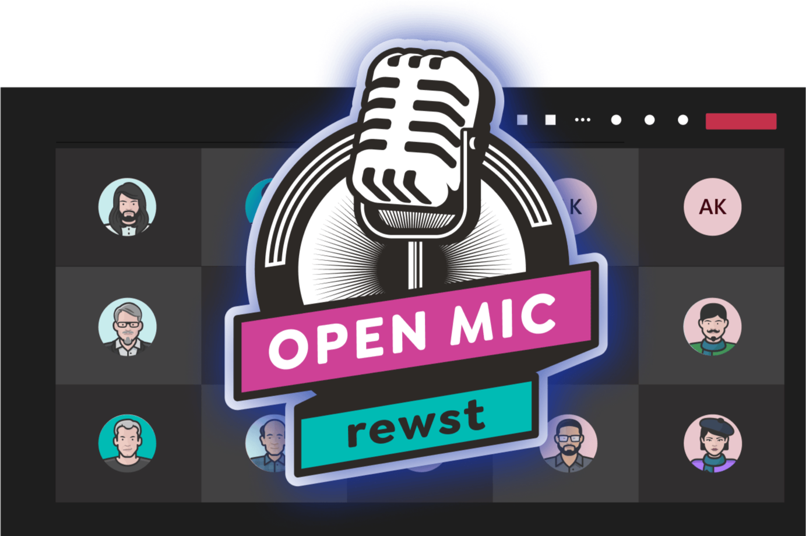

# Rewst Open Mic

<figure><figcaption></figcaption></figure>

\
This isn’t your typical vendor call—it’s where our community gathers to grow! It’s also where we share what’s new in Rewst, giving attendees a first look at upcoming features, product updates, and improvements in progress. Think town hall with a talent show twist — practical, collaborative, and always worth your time.\
Is 3pm EST on Fridays not a great time for you? Check out our EU and ANZ monthly calls where you can catch all the latest Rewst updates and have the opportunity to view or present live automation demos.

<figure><figcaption></figcaption></figure>

## Register for the Rewst Community Open Mic

Click through to our website [here](https://rewst.io/support/community) and scroll down the page to access our signup form. Check off the relevant boxes to receive invites for the Open Mic for one or more of our regional calls.&#x20;

## Archive of previous Open Mic recordings&#x20;

View all previous Open Mic recordings on our website [here](https://rewst.io/resources/videos?filter=all). Or, if you prefer, visit our YouTube channel to view playlists for each region's Open Mic [here](https://www.youtube.com/playlist?list=PLDWjfoX6CSp9BQnZKRRjnt4wJtQjdLJch).&#x20;

## Latest NA Open Mic video recording



## Latest EU Open Mic video recording



## Latest ANZ Open Mic video recording


